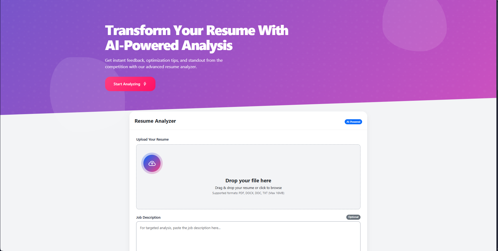

<!-- PROJECT LOGO -->
<p align="center">
  
</p>

<h1 align="center">🚀 AI Resume Analyzer</h1>

<p align="center">
  ⚡ An intelligent web-based application that analyzes resumes using AI and NLP techniques to assess how well they match a given job description. Designed for job seekers to optimize their resumes and increase chances of passing Applicant Tracking Systems (ATS).
  <br />
  💼 Optimize your resume to beat the ATS bots!
  <br /><br />
  <a href="#📸-demo">View Demo</a> ·
  <a href="#🛠️-installation">Installation</a> ·
  <a href="#📬-feedback">Send Feedback</a>
</p>

---

## ✨ Features

- 🧠 **AI-Powered Resume Analysis**
- 📄 **Smart Resume Parsing**
- 📌 **Keyword & Skill Matching**
- 🔍 **Job Description Comparison**
- 📊 **Detailed Scoring & Feedback**
- 🌐 **Clean & Interactive Web UI**

---

## 🖼️ Demo



---

## 🗂️ Project Structure

```
AI Resume Analyzer/
├── app.py                 # Main Flask application
├── requirements.txt       # Python dependencies
│
├── static/                # JS/CSS assets
│   ├── script.js
│   └── styles.css
│
├── templates/             # HTML templates
│   ├── index.html
│   └── results.html
│
├── uploads/               # Uploaded resume files
│   └── Resume.pdf
│
└── utils/                 # Core logic modules
    ├── resume_parser.py
    ├── job_matcher.py
    └── ats_scorer.py
```

---

## ⚙️ How It Works

1. 📤 Upload your resume in PDF format.
2. 📝 Paste a job description.
3. 🧾 Resume is parsed and analyzed.
4. 🧮 Scores are generated based on keyword and semantic matching.
5. ✅ View insights and suggestions on improving your resume.

---

## 🔧 Tech Stack

| Frontend     | Backend  | NLP/Logic     |
|--------------|----------|---------------|
| HTML5, CSS3  | Flask    | Spacy / Regex |
| JavaScript   | Python 3 | Custom Match Logic |

---

## 🛠️ Installation

```bash
# 1️⃣ Clone the repo
git clone https://github.com/jpravin664/AI-Resume-analyzer
cd ai-resume-analyzer

# 2️⃣ (Optional) Create a virtual environment
python -m venv venv
source venv/bin/activate  # Windows: venv\Scripts\activate

# 3️⃣ Install dependencies
pip install -r requirements.txt

# 4️⃣ Run the app
python app.py
```

---

## 📬 Feedback

🙌 If you find this project helpful, consider giving it a ⭐  
🛠️ Contributions, feature requests, and issues are welcome!

---

<p align="center">
  Made with ❤️ by <strong>Pravin J</strong>
</p>
